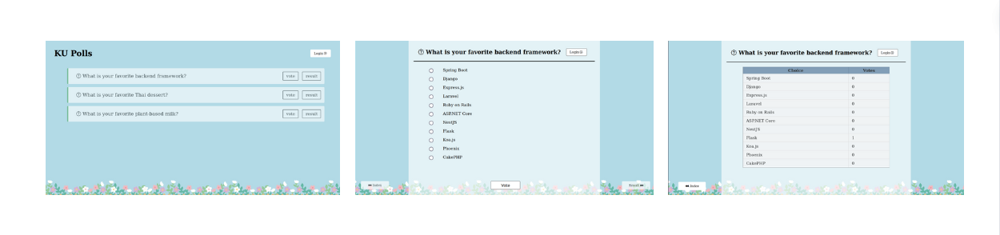

# KU Polls : Online Survey Question
[](../../actions/workflows/ku_polls.yml)

An application to conduct online polls and surveys based on the [Django Tutorial project](https://docs.djangoproject.com/en/5.1/intro/tutorial01/), 
with additional features.<br>
This app was created as part of the [Individual Software Process](
https://cpske.github.io/ISP) course at [Kasetsart University](https://www.ku.ac.th).
<br><br>


## Application UI
<br><br>

## Requirements
KU Polls recommend using python version 3.11 and other requirements are in [requirement](requirements.txt).<br><br>

## Installation
Follow the instruction in  [Instruction](Installation.md).<br><br>

## Running the Application
1. Run the django development server <br>
```
python manage.py runserver
```
The default port is 8000, but you can choose your own port from 1024 through 49151.
```
python manage.py runserver 8000
```
2. Open the server on your browser
<br><br>
## Demo Admin Account
| Username | Password | 
|:--------:|:--------:|
|  admin   | admin123 |

## Demo User Account
| Username | Password  | 
|:--------:|:---------:|
|  demo1   | Hackme11  |  
|  demo2   | Hackme22  |  
|  demo3   | Hackme33  |  


## Documents
All project documents are in the [Project Wiki](../../wiki/Home).

- [Vision Statement](../../wiki/Vision%20and%20Scope)
- [Requirements](../../wiki/Requirements)
- [Project Plan](../../wiki/Project%20Plan)
- [Domain Model](../../wiki/Domain%20Model)

## Iteration Plan
- [Iteration 1 Plan](../../wiki/Iteration%201%20Plan)
- [Iteration 2 Plan](../../wiki/Iteration%202%20Plan)
- [Iteration 3 Plan](../../wiki/Iteration%203%20Plan)
- [Iteration 4 Plan](../../wiki/Iteration%204%20Plan)
